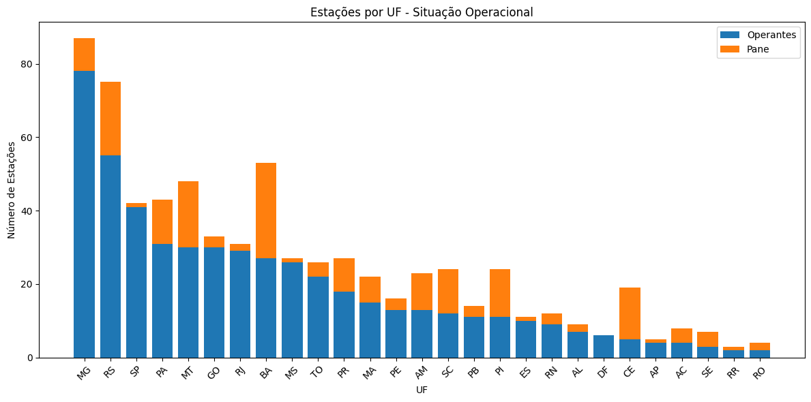
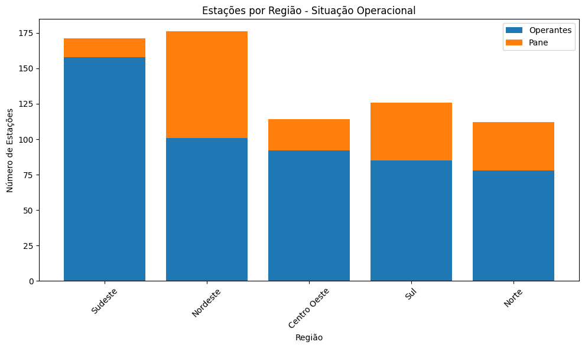
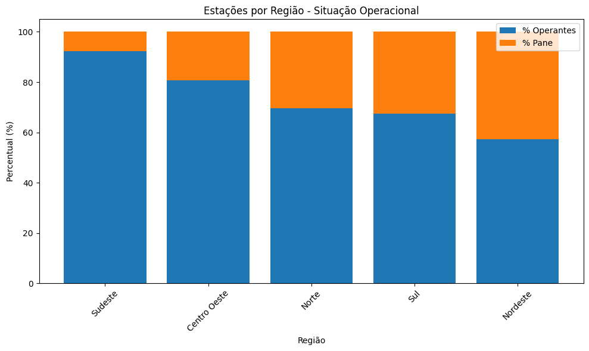
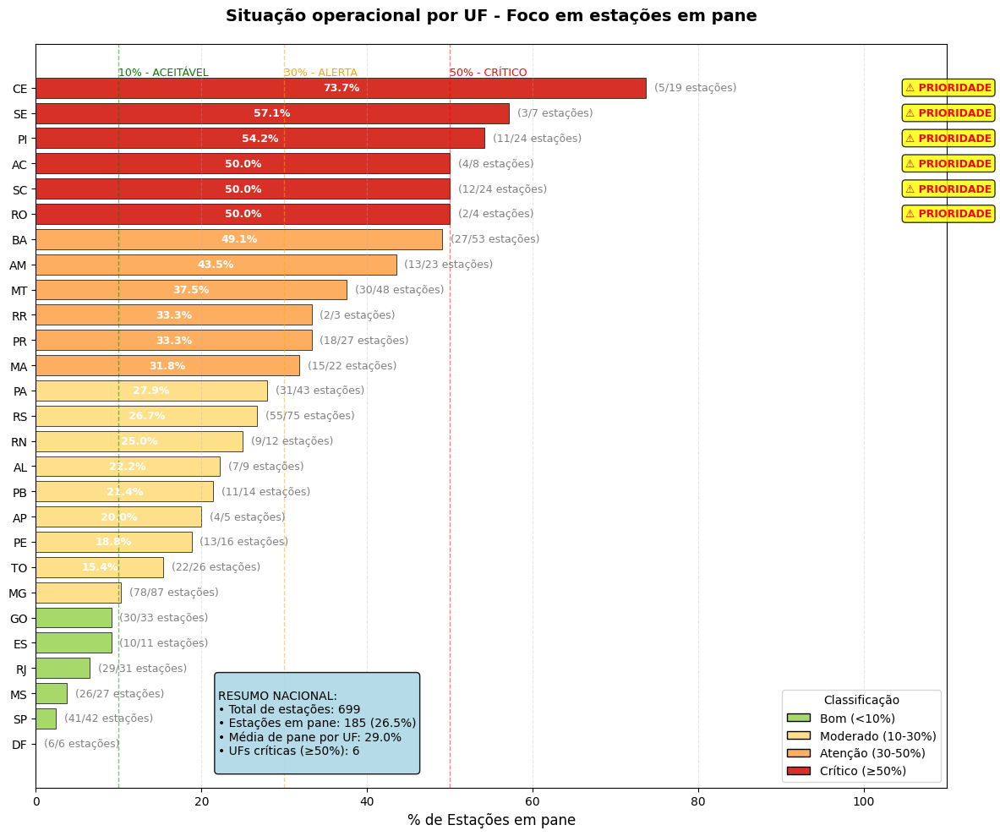
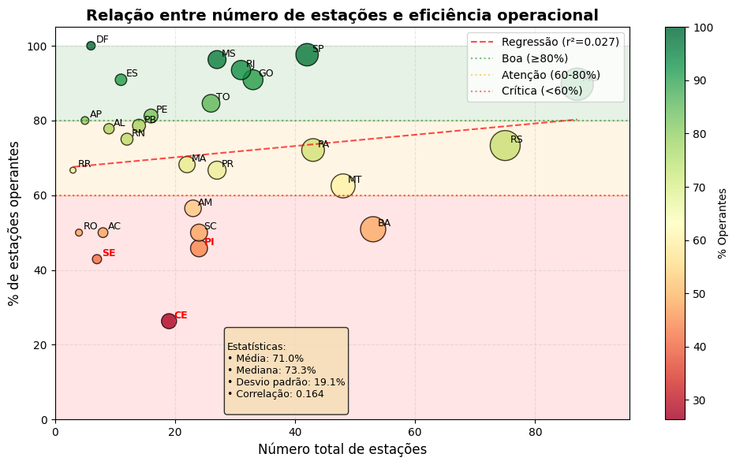
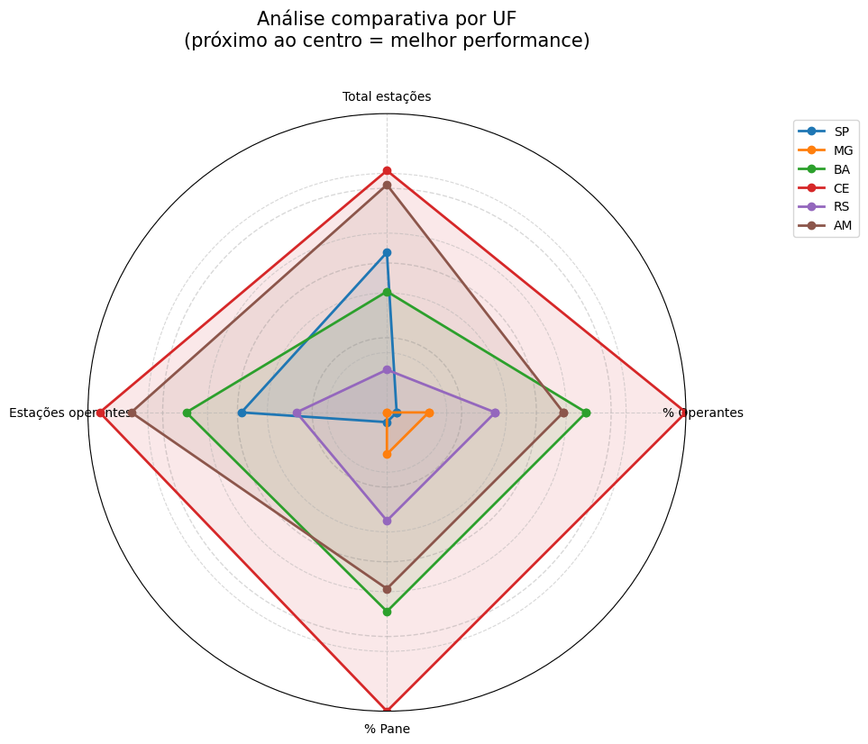

# Situação funcional das estações metereológicas do InMet

O Instituto Nacional de Meteorologia - **InMet** - opera uma ampla rede de estações meteorológicas distribuídas por todo o território nacional. Essas estações integram o subsistema de coleta de dados e são equipadas com sensores que medem variáveis ambientais. O sistema completo também inclui unidades de controle e armazenamento, gerenciamento de energia, comunicação, banco de dados e compartilhamento das informações.

As principais variáveis meteorológicas monitoradas são: temperatura, umidade, pressão atmosférica, precipitação, direção e velocidade dos ventos e radiação solar

As estações classificam-se em dois tipos:

* **Convencionais**: requerem um observador para coleta manual dos dados em intervalos predefinidos.

* **Automáticas**: utilizam sensores conectados a um sistema informatizado, que realiza a captura, o armazenamento e o processamento dos dados de forma automática.

A seguir, realizamos uma análise da situação funcional das estações metereológicas, por estado e região, a partir dos catálogos disponíveis em formato **csv** nos seguintes endereços:

**Estações convencionais**: https://portal.inmet.gov.br/paginas/catalogoman#

**Estações automáticas**: https://portal.inmet.gov.br/paginas/catalogoaut#


### Importamos as bibliotecas


```python
import pandas as pd
import numpy as np
from scipy import stats
import geobr
import folium
from folium.plugins import Fullscreen
from branca.colormap import LinearColormap
import matplotlib.pyplot as plt
from matplotlib.patches import Circle
```

### Processamos os arquivos baixados


```python
arquivos = ["CatalogoEstaçõesAutomáticas.csv", "CatalogoEstaçõesConvencionais.csv"]
dataframes = []

for arquivo in arquivos:
    df_temp = pd.read_csv(arquivo,
                            sep=';',
                            header=0,
                            dtype={'DC_NOME': str, 'SG_ESTADO': str, 'CD_SITUACAO': str, 'VL_LATITUDE': str,
                                   'VL_LONGITUDE': str,
                                   'VL_ALTITUDE': str, 'DT_INICIO_OPERACAO': str, 'CD_ESTACAO': str})
    df_temp.columns = ['nome', 'uf', 'situacao', 'latitude', 'longitude', 'altitude', 'dt_inicio_op', 'codigo']
    dataframes.append(df_temp)
    
estacoes = pd.concat(dataframes, ignore_index=True)

estacoes['situacao'] = estacoes['situacao'].map({'Pane': 0, 'Operante': 1})

# Convertemos as colunas numéricas
estacoes['latitude'] = estacoes['latitude'].str.replace(',', '.').astype(float)
estacoes['longitude'] = estacoes['longitude'].str.replace(',', '.').astype(float)
estacoes['altitude'] = estacoes['altitude'].str.replace(',', '.').astype(float)

# Convertemos a coluna 'Data' para o formato datetime
estacoes['dt_inicio_op'] = pd.to_datetime(estacoes['dt_inicio_op'], format='%d/%m/%Y')
```

### Verificamos uma amostra do dataframe


```python
print(estacoes.head())
```

                 nome  uf  situacao   latitude  longitude  altitude dt_inicio_op  \
    0        ABROLHOS  BA         0 -17.963056 -38.703333     20.93   2008-07-20   
    1          ACARAU  CE         0  -3.121111 -40.087222     67.15   2009-04-21   
    2          ACEGUA  RS         1 -31.874722 -54.119722    271.00   2025-09-16   
    3  AFONSO CLAUDIO  ES         1 -20.104167 -41.106944    507.48   2011-09-23   
    4        AGUA BOA  MT         1 -14.016389 -52.211667    440.00   2006-12-15   
    
      codigo  
    0   A422  
    1   A360  
    2   B828  
    3   A657  
    4   A908  


### Inspecionamos o dataframe


```python
estacoes.info()
```

    <class 'pandas.core.frame.DataFrame'>
    RangeIndex: 699 entries, 0 to 698
    Data columns (total 8 columns):
     #   Column        Non-Null Count  Dtype         
    ---  ------        --------------  -----         
     0   nome          699 non-null    object        
     1   uf            699 non-null    object        
     2   situacao      699 non-null    int64         
     3   latitude      699 non-null    float64       
     4   longitude     699 non-null    float64       
     5   altitude      699 non-null    float64       
     6   dt_inicio_op  699 non-null    datetime64[ns]
     7   codigo        699 non-null    object        
    dtypes: datetime64[ns](1), float64(3), int64(1), object(3)
    memory usage: 43.8+ KB


### Calculamos a quantidade de estações por tipo


```python
# Separamos as estações por tipo baseado no padrão do código
convencionais = estacoes[estacoes['codigo'].str.match(r'^\d+$')]
automaticas = estacoes[estacoes['codigo'].str.match(r'^[A-Za-z]')]

# Mostramos informações quantitativas sobre os diferentes tipos
print(f"Quantidade de estações convencionais: {len(convencionais)}")
print(f"Quantidade de estações automáticas: {len(automaticas)}")
```

    Quantidade de estações convencionais: 105
    Quantidade de estações automáticas: 594


### Calculamos a quantidade de estações por *status* operacional


```python
print("Contagem total por situação:")
print(estacoes['situacao'].value_counts().rename({0: 'Pane', 1: 'Operante'}))

# Ou com percentuais:
total = len(estacoes)
print(f"\nTotal de estações: {total}")
print(f"Operantes: {estacoes['situacao'].sum()} ({(estacoes['situacao'].sum()/total*100):.1f}%)")
print(f"Em pane: {(estacoes['situacao'] == 0).sum()} ({((estacoes['situacao'] == 0).sum()/total*100):.1f}%)")
```

    Contagem total por situação:
    situacao
    Operante    514
    Pane        185
    Name: count, dtype: int64
    
    Total de estações: 699
    Operantes: 514 (73.5%)
    Em pane: 185 (26.5%)


### Agrupamos as estações por UF


```python
contagem_uf = estacoes.groupby('uf').agg(
    total=('situacao', 'count'),
    operantes=('situacao', 'sum'),
    pane=('situacao', lambda x: (x == 0).sum())
).reset_index()

# Adicionando percentuais
contagem_uf['perc_operantes'] = (contagem_uf['operantes'] / contagem_uf['total'] * 100).round(1)
contagem_uf['perc_pane'] = (contagem_uf['pane'] / contagem_uf['total'] * 100).round(1)

print("\nContagem por UF:")
print(contagem_uf.sort_values('total', ascending=False))
```

    
    Contagem por UF:
        uf  total  operantes  pane  perc_operantes  perc_pane
    10  MG     87         78     9            89.7       10.3
    22  RS     75         55    20            73.3       26.7
    4   BA     53         27    26            50.9       49.1
    12  MT     48         30    18            62.5       37.5
    13  PA     43         31    12            72.1       27.9
    25  SP     42         41     1            97.6        2.4
    8   GO     33         30     3            90.9        9.1
    18  RJ     31         29     2            93.5        6.5
    17  PR     27         18     9            66.7       33.3
    11  MS     27         26     1            96.3        3.7
    26  TO     26         22     4            84.6       15.4
    16  PI     24         11    13            45.8       54.2
    23  SC     24         12    12            50.0       50.0
    2   AM     23         13    10            56.5       43.5
    9   MA     22         15     7            68.2       31.8
    5   CE     19          5    14            26.3       73.7
    15  PE     16         13     3            81.2       18.8
    14  PB     14         11     3            78.6       21.4
    19  RN     12          9     3            75.0       25.0
    7   ES     11         10     1            90.9        9.1
    1   AL      9          7     2            77.8       22.2
    0   AC      8          4     4            50.0       50.0
    24  SE      7          3     4            42.9       57.1
    6   DF      6          6     0           100.0        0.0
    3   AP      5          4     1            80.0       20.0
    20  RO      4          2     2            50.0       50.0
    21  RR      3          2     1            66.7       33.3


### Visualizamos o gráfico de barras por UF


```python
plt.figure(figsize=(12, 6))
por_uf_sorted = contagem_uf.sort_values('operantes', ascending=False)
plt.bar(por_uf_sorted['uf'], por_uf_sorted['operantes'], label='Operantes')
plt.bar(por_uf_sorted['uf'], por_uf_sorted['pane'], 
        bottom=por_uf_sorted['operantes'], label='Pane')
plt.title('Estações por UF - Situação Operacional')
plt.xlabel('UF')
plt.ylabel('Número de Estações')
plt.legend()
plt.xticks(rotation=45)
plt.tight_layout()
plt.show()
```


    

    


## Gráficos de barras por região

**Baixamos o GeoDataFrame**

Para agruparmos os dados por região, utilizamos o pacote **geobr**, desenvolvido e mantido pela equipe do **IPEA** - *Instituto de Pesquisa Econômica Aplicada*, para gerar um *GeoDataFrame* das unidades da federação.


```python
estados = geobr.read_state(year=2019)
```

O objeto **estados** é um *GeoDataFrame* que armazena dados geoespaciais e contém uma coluna que representa a região a que pertence cada unidade da federação.


```python
print(estados.head())
```

       code_state abbrev_state name_state  code_region name_region  \
    0        11.0           RO   Rondônia          1.0       Norte   
    1        12.0           AC       Acre          1.0       Norte   
    2        13.0           AM   Amazônas          1.0       Norte   
    3        14.0           RR    Roraima          1.0       Norte   
    4        15.0           PA       Pará          1.0       Norte   
    
                                                geometry  
    0  MULTIPOLYGON (((-65.3815 -10.42907, -65.37916 ...  
    1  MULTIPOLYGON (((-71.07772 -9.82774, -71.08554 ...  
    2  MULTIPOLYGON (((-69.83766 -3.68659, -69.7123 -...  
    3  MULTIPOLYGON (((-63.96008 2.47313, -63.96041 2...  
    4  MULTIPOLYGON (((-51.43248 -0.47334, -51.42843 ...  


**Mesclamos os dataframes**

Combinamos os dataframes **estados** e **contagem_uf** através das chaves que identificam as unidades da federação.


```python
estados_merged = estados.merge(contagem_uf, 
                               left_on='abbrev_state', 
                               right_on='uf', 
                               how='left')

```

**Inspecionamos o novo dataframe**


```python
print(estados_merged.head())
```

       code_state abbrev_state name_state  code_region name_region  \
    0        11.0           RO   Rondônia          1.0       Norte   
    1        12.0           AC       Acre          1.0       Norte   
    2        13.0           AM   Amazônas          1.0       Norte   
    3        14.0           RR    Roraima          1.0       Norte   
    4        15.0           PA       Pará          1.0       Norte   
    
                                                geometry  uf  total  operantes  \
    0  MULTIPOLYGON (((-65.3815 -10.42907, -65.37916 ...  RO      4          2   
    1  MULTIPOLYGON (((-71.07772 -9.82774, -71.08554 ...  AC      8          4   
    2  MULTIPOLYGON (((-69.83766 -3.68659, -69.7123 -...  AM     23         13   
    3  MULTIPOLYGON (((-63.96008 2.47313, -63.96041 2...  RR      3          2   
    4  MULTIPOLYGON (((-51.43248 -0.47334, -51.42843 ...  PA     43         31   
    
       pane  perc_operantes  perc_pane  
    0     2            50.0       50.0  
    1     4            50.0       50.0  
    2    10            56.5       43.5  
    3     1            66.7       33.3  
    4    12            72.1       27.9  


**Agrupamos por região**


```python
regiao_stats = estados_merged.groupby('name_region').agg(
    total=('total', 'sum'),
    operantes=('operantes', 'sum'),
    pane=('pane', 'sum')
).reset_index()

regiao_stats['perc_operantes'] = (regiao_stats['operantes'] / regiao_stats['total'] * 100).round(1)
regiao_stats['perc_pane'] = (regiao_stats['pane'] / regiao_stats['total'] * 100).round(1)
```

### Gráfico A: dados absolutos/contagem


```python
# Gráfico de barras por região
plt.figure(figsize=(10, 6))
regiao_sorted = regiao_stats.sort_values('operantes', ascending=False)
plt.bar(regiao_sorted['name_region'], regiao_sorted['operantes'], label='Operantes')
plt.bar(regiao_sorted['name_region'], regiao_sorted['pane'], bottom=regiao_sorted['operantes'], label='Pane')
plt.title('Estações por Região - Situação Operacional')
plt.xlabel('Região')
plt.ylabel('Número de Estações')
plt.legend()
plt.xticks(rotation=45)
plt.tight_layout()
plt.show()
```


    

    


### Gráfico B: dados relativos/percentuais


```python
# Gráfico de barras por região
plt.figure(figsize=(10, 6))
regiao_sorted = regiao_stats.sort_values('perc_operantes', ascending=False)
plt.bar(regiao_sorted['name_region'], regiao_sorted['perc_operantes'], label='% Operantes')
plt.bar(regiao_sorted['name_region'], regiao_sorted['perc_pane'], 
        bottom=regiao_sorted['perc_operantes'], label='% Pane')
plt.title('Estações por Região - Situação Operacional')
plt.xlabel('Região')
plt.ylabel('Percentual (%)')
plt.legend()
plt.xticks(rotation=45)
plt.tight_layout()
plt.show()
```


    

    


### Foco nas estações em pane


```python
# Ordenar por percentual de pane (pior primeiro)
contagem_uf_sorted = contagem_uf.sort_values('perc_pane', ascending=True).reset_index(drop=True)

# Cores baseadas no percentual
colors = []
for perc in contagem_uf_sorted['perc_pane']:
    if perc >= 50:
        colors.append('#d73027')  # Vermelho escuro - crítico
    elif perc >= 30:
        colors.append('#fdae61')  # Laranja - atenção
    elif perc >= 10:
        colors.append('#fee08b')  # Amarelo - moderado
    else:
        colors.append('#a6d96a')  # Verde - bom

fig, ax = plt.subplots(figsize=(12, 10))

# Criar barras horizontais
bars = ax.barh(contagem_uf_sorted['uf'], contagem_uf_sorted['perc_pane'], 
               color=colors, edgecolor='black', linewidth=0.5)

# Adicionar valores nas barras
for i, (bar, perc, total, op) in enumerate(zip(bars, 
                                                contagem_uf_sorted['perc_pane'],
                                                contagem_uf_sorted['total'],
                                                contagem_uf_sorted['operantes'])):
    # Texto dentro da barra (se espaço suficiente)
    if perc > 15:
        ax.text(perc/2, bar.get_y() + bar.get_height()/2, 
                f'{perc:.1f}%', va='center', ha='center',
                color='white', fontweight='bold', fontsize=9)
    
    # Texto fora da barra com informações adicionais
    ax.text(perc + 1, bar.get_y() + bar.get_height()/2,
            f'({op}/{total} estações)', va='center',
            fontsize=9, color='gray')

# Configurar eixos
ax.set_xlabel('% de Estações em pane', fontsize=12)
ax.set_title('Situação operacional por UF - Foco em estações em pane', 
             fontsize=14, fontweight='bold', pad=20)

# Adicionar linhas de referência
ax.axvline(x=50, color='red', linestyle='--', alpha=0.5, linewidth=1)
ax.axvline(x=30, color='orange', linestyle='--', alpha=0.5, linewidth=1)
ax.axvline(x=10, color='green', linestyle='--', alpha=0.5, linewidth=1)

# Adicionar legendas para as linhas
ax.text(50, len(contagem_uf_sorted)-0.5, '50% - CRÍTICO', 
        color='red', fontsize=9, va='baseline')
ax.text(30, len(contagem_uf_sorted)-0.5, '30% - ALERTA', 
        color='orange', fontsize=9, va='baseline')
ax.text(10, len(contagem_uf_sorted)-0.5, '10% - ACEITÁVEL', 
        color='green', fontsize=9, va='baseline')

# Destacar UFs problemáticas
problem_ufs = contagem_uf_sorted[contagem_uf_sorted['perc_pane'] >= 50]
for i, row in problem_ufs.iterrows():
    ax.text(105, i, '⚠️ PRIORIDADE', color='red', fontweight='bold',
            va='center', fontsize=9, bbox=dict(boxstyle='round', facecolor='yellow', alpha=0.8))

# Ajustar limites
ax.set_xlim(0, 110)
ax.grid(axis='x', linestyle='--', alpha=0.3)

# Adicionar legenda de cores
from matplotlib.patches import Patch
legend_elements = [
    Patch(facecolor='#a6d96a', edgecolor='black', label='Bom (<10%)'),
    Patch(facecolor='#fee08b', edgecolor='black', label='Moderado (10-30%)'),
    Patch(facecolor='#fdae61', edgecolor='black', label='Atenção (30-50%)'),
    Patch(facecolor='#d73027', edgecolor='black', label='Crítico (≥50%)')
]
ax.legend(handles=legend_elements, loc='lower right', title='Classificação')

# Adicionar resumo estatístico
total_estacoes = contagem_uf_sorted['total'].sum()
total_pane = contagem_uf_sorted['pane'].sum()
media_pane = contagem_uf_sorted['perc_pane'].mean()

summary_text = f'''
RESUMO NACIONAL:
• Total de estações: {total_estacoes}
• Estações em pane: {total_pane} ({total_pane/total_estacoes*100:.1f}%)
• Média de pane por UF: {media_pane:.1f}%
• UFs críticas (≥50%): {len(problem_ufs)}
'''
ax.text(0.20, 0.15, summary_text, transform=ax.transAxes,
        fontsize=10, verticalalignment='top',
        bbox=dict(boxstyle='round', facecolor='lightblue', alpha=0.9))

plt.tight_layout()
plt.show()
```


    

    


### Eficiência operacional


```python
plt.figure(figsize=(10, 6))

# Criar scatter plot
scatter = plt.scatter(
    contagem_uf['total'], 
    contagem_uf['perc_operantes'],
    s=contagem_uf['total']*10,  # Tamanho proporcional ao total
    c=contagem_uf['perc_operantes'],
    cmap='RdYlGn',
    alpha=0.8,
    edgecolors='black',
    linewidth=1
)

# Adicionar rótulos para cada UF
for i, row in contagem_uf.iterrows():
    plt.text(
        row['total'] + 0.8, 
        row['perc_operantes'] + 0.8, 
        row['uf'],
        fontsize=9,
        fontweight='bold' if row['perc_operantes'] < 50 else 'normal',
        color='red' if row['perc_operantes'] < 50 else 'black'
    )

# Calcular e plotar linha de regressão
x = contagem_uf['total'].values
y = contagem_uf['perc_operantes'].values

# Remover valores NaN se houver
mask = ~np.isnan(x) & ~np.isnan(y)
x_clean = x[mask]
y_clean = y[mask]

if len(x_clean) > 1:
    slope, intercept, r_value, p_value, std_err = stats.linregress(x_clean, y_clean)
    
    # Plotar linha de regressão
    x_line = np.linspace(min(x_clean), max(x_clean), 100)
    y_line = slope * x_line + intercept
    plt.plot(x_line, y_line, 'r--', alpha=0.7, 
             label=f'Regressão (r²={r_value**2:.3f})')

# Configurações do gráfico
plt.xlabel('Número total de estações', fontsize=12)
plt.ylabel('% de estações operantes', fontsize=12)
plt.title('Relação entre número de estações e eficiência operacional', fontsize=14, fontweight='bold')
plt.grid(True, linestyle='--', alpha=0.3)
plt.colorbar(scatter, label='% Operantes')

# Adicionar zonas de análise
plt.axhline(y=80, color='green', linestyle=':', alpha=0.5, label='Boa (≥80%)')
plt.axhline(y=60, color='orange', linestyle=':', alpha=0.5, label='Atenção (60-80%)')
plt.axhline(y=60, color='red', linestyle=':', alpha=0.5, label='Crítica (<60%)')

# Preencher áreas
plt.fill_between([0, max(contagem_uf['total'])*1.1], 80, 100, alpha=0.1, color='green')
plt.fill_between([0, max(contagem_uf['total'])*1.1], 60, 80, alpha=0.1, color='orange')
plt.fill_between([0, max(contagem_uf['total'])*1.1], 0, 60, alpha=0.1, color='red')

plt.legend(loc='upper right')
plt.xlim(0, max(contagem_uf['total'])*1.1)
plt.ylim(0, 105)

# Adicionar estatísticas no canto
stats_text = f'''
Estatísticas:
• Média: {y.mean():.1f}%
• Mediana: {np.median(y):.1f}%
• Desvio padrão: {y.std():.1f}%
• Correlação: {r_value:.3f}
'''
plt.text(0.30, 0.02, stats_text, transform=plt.gca().transAxes,
         fontsize=9, verticalalignment='bottom',
         bbox=dict(boxstyle='round', facecolor='wheat', alpha=0.8))

plt.tight_layout()
plt.show()
```


    

    


### Gráfico de radar


```python
# Selecionar métricas para análise
metrics = ['perc_operantes', 'total', 'operantes', 'perc_pane']
uf_selecionadas = ['SP', 'MG', 'BA', 'CE', 'RS', 'AM']  # Exemplos

fig, ax = plt.subplots(figsize=(10, 10), subplot_kw=dict(projection='polar'))

# Normalizar dados para escala 0-1
def normalize(series):
    return (series - series.min()) / (series.max() - series.min())

# Preparar dados
angles = np.linspace(0, 2*np.pi, len(metrics), endpoint=False).tolist()
angles += angles[:1]  # Fechar o polígono

# Plotar cada UF
for uf in uf_selecionadas:
    dados_uf = contagem_uf[contagem_uf['uf'] == uf].iloc[0]
    valores = []
    
    for metric in metrics:
        if metric == 'perc_operantes':  # Inverter para alinhar (maior = melhor)
            valor = 1 - normalize(contagem_uf[metric])[contagem_uf['uf'] == uf].values[0]
        elif metric == 'perc_pane':  # Manter direto (maior = pior)
            valor = normalize(contagem_uf[metric])[contagem_uf['uf'] == uf].values[0]
        else:  # Para totais, maior = melhor
            valor = 1 - normalize(contagem_uf[metric])[contagem_uf['uf'] == uf].values[0]
        
        valores.append(valor)
    
    valores += valores[:1]
    
    ax.plot(angles, valores, linewidth=2, label=uf, marker='o')
    ax.fill(angles, valores, alpha=0.1)

# Configurar eixos
ax.set_xticks(angles[:-1])
ax.set_xticklabels(['% Operantes', 'Total estações', 'Estações operantes', '% Pane'])
ax.set_yticklabels([])
ax.set_ylim(0, 1)

# Adicionar grades
ax.grid(True, linestyle='--', alpha=0.5)

# Adicionar círculos de referência
for i in [0.25, 0.5, 0.75]:
    circle = Circle((0, 0), i, transform=ax.transData._b, 
                    facecolor='none', edgecolor='gray', linestyle='--', alpha=0.3)
    ax.add_patch(circle)

plt.title('Análise comparativa por UF\n(próximo ao centro = melhor performance)', 
          size=15, y=1.1)
plt.legend(loc='upper right', bbox_to_anchor=(1.3, 1.0))
plt.tight_layout()
plt.show()
```


    

    


**Considerações finais:**

As previsões metereológicas são realizadas em supercomputadores, através de modelos numéricos. Caso as informações fornecidas pelas estações sejam insuficientes, podem ser utilizadas imagens de satélites e dados de radares metereológicos.


**Fontes:**

https://wp.ufpel.edu.br/mateusteixeira/files/2021/12/Curso_def_civil_estacoes_meteorologicas.pdf<br>
https://www2.ufjf.br/labcaa/rede-de-estacoes-inmet/<br>
https://portal.inmet.gov.br/sobre-meteorologia<br>
https://github.com/ipeaGIT/geobr<br>
https://www.cemtec.ms.gov.br/wp-content/uploads/2019/02/Nota_Tecnica-Rede_estacoes_INMET.pdf


```python

```
